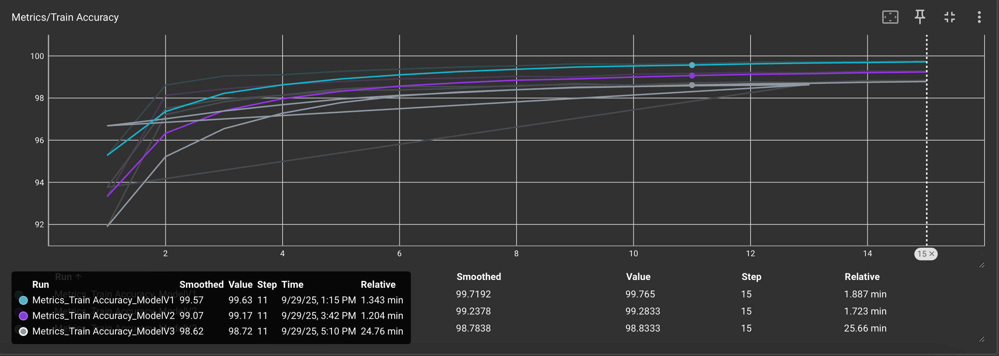
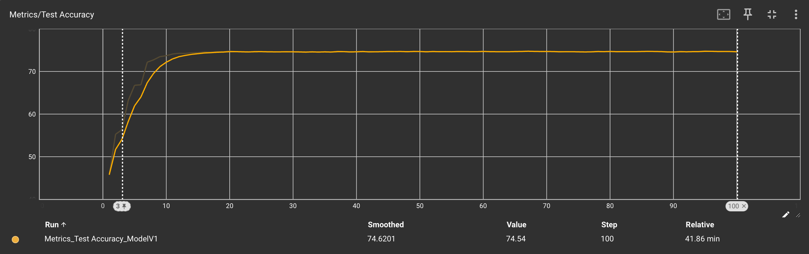
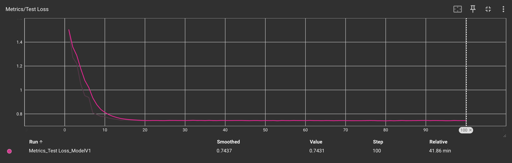

# PyTorch CIFAR10 Models

## Observations

I experimented with 3 models and following are my observations,

|                    | Model v1                                                                   | Model v2                                                             | Model v3                                                     |
|--------------------|----------------------------------------------------------------------------|----------------------------------------------------------------------|--------------------------------------------------------------|
| Target             | 1. Basic setup<br>2. Introduce regularisation<br>3. Global Average Pooling | 1. Aggressively reduce parameters                                    | Improve model accuracy                                       |
| Parameter<br>Count | 24,986                                                                     | 7,538                                                                | 7,316                                                        |
| Analysis           | 1. Model is moderately heavy<br>2. Overfitting                             | 1. Model is light<br>2. Moderately overfitting<br>3. Accuracy tanked | 1. Model is light<br>2. No overfitting<br>3. Accuracy tanked |
| Accuracy           | 99.40                                                                      | 99.21                                                                | 99.26                                                        |
| Loss               | 0.0201                                                                     | 0.0240                                                               | 0.0227                                                       |

## Logs and Visualisations

Please open up tensorboard by running the following command inside the project directory:

```sh
tensorboard --logdir logs/fit
```

Navigate to <http://localhost:6006/?darkMode=true#scalars> to open up the dashboard.

### Accuracy and Loss

#### Train Accuracy



#### Test Accuracy



#### Test Loss


