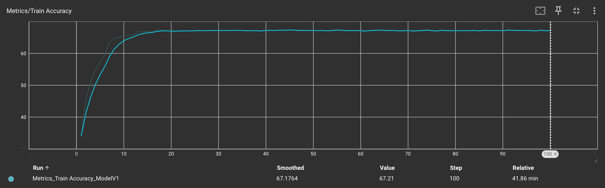

# PyTorch CIFAR10 Models

## Observations

- Training accuracy: 67.21%
- Testing accuracy: 74.54%

## Logs and Visualisations

Please open up tensorboard by running the following command inside the project directory:

```sh
tensorboard --logdir logs/fit
```

Navigate to <http://localhost:6006/?darkMode=true#scalars> to open up the dashboard.

### Accuracy and Loss

#### Train Accuracy



#### Test Accuracy


#### Test Loss


